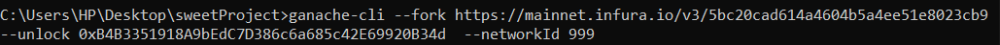
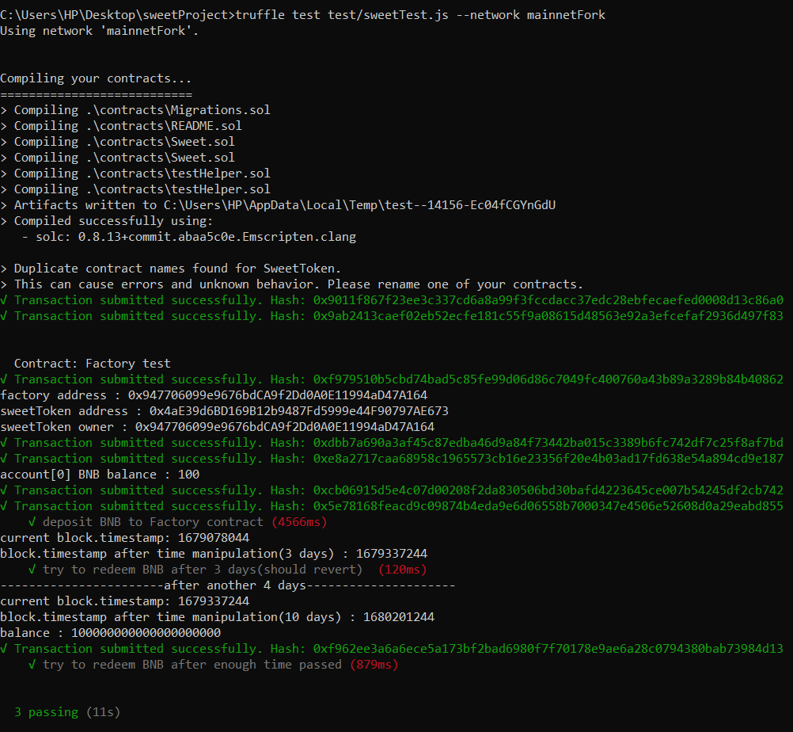

this project is a simple DeFi protocol and the algorithm is as below :
there is an ERC20 token *SWEET* - create a contract to distribute it.  
- A users can call a deposit function to deposit **BNB* and get *SWEET* (ratio 1:10)*
- A user can call a redeem function to burn their **SWEET* and get back their *BNB**
- A user can redeem only 7 days after their deposit
- Any new deposit reset the time lock to 7 days for the whole user balance

## run the test using ganache-cli by forking Ethereum mainnet
1) Call command below in CMD to run ganache on the mainnet fork:  

Now ganache is running on the mainnet fork.  

2) Open a new terminal and call command below:  

